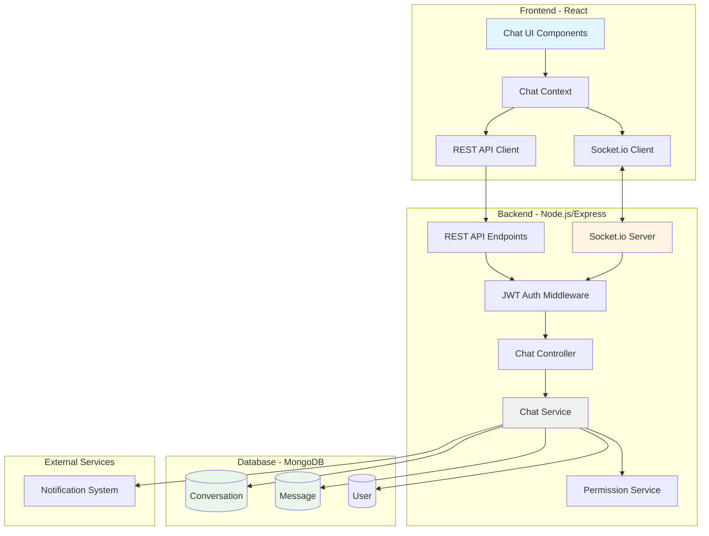
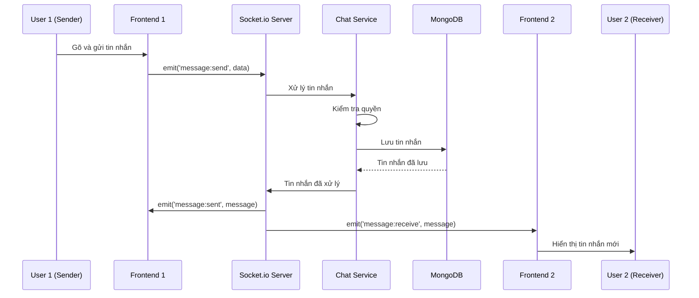
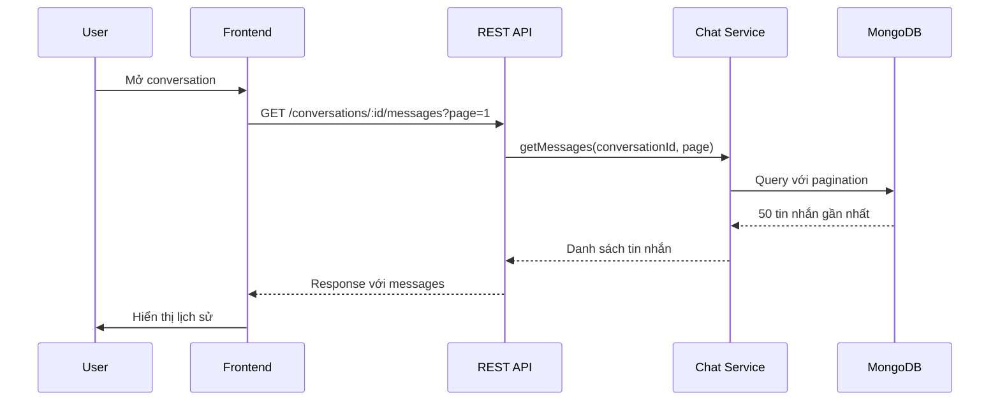

# Tài liệu Thiết kế - Tính năng Chat Thời gian Thực

## Tổng quan

Tính năng Chat Thời gian Thực cho phép Admin, Teacher và Student giao tiếp trực tiếp với nhau theo quy tắc phân quyền cụ thể. Hệ thống sử dụng Socket.io để truyền tin nhắn thời gian thực, MongoDB để lưu trữ lịch sử tin nhắn, và tích hợp với hệ thống JWT authentication hiện có.

### Quy tắc phân quyền chat

- **Admin**: Có thể chat với tất cả (Admin, Teacher, Student)
- **Teacher**: Có thể chat với Admin và Student (không chat với Teacher khác)
- **Student**: Có thể chat với Admin và Teacher (không chat với Student khác)

### Các tính năng chính

1. Nhắn tin thời gian thực qua Socket.io
2. Lưu trữ và phân trang lịch sử tin nhắn (50 tin nhắn/lần)
3. Đếm tin nhắn chưa đọc
4. Hiển thị trạng thái online/offline
5. Chỉ báo đang gõ (typing indicator)
6. Tích hợp với hệ thống thông báo hiện có
7. Tìm kiếm người dùng
8. Giao diện responsive (desktop/tablet/mobile)
9. Xử lý lỗi kết nối với retry logic

## Kiến trúc

### Sơ đồ kiến trúc tổng quan



### Luồng dữ liệu chính

#### 1. Gửi tin nhắn



#### 2. Tải lịch sử tin nhắn



## Các thành phần và Giao diện

### Backend Components

#### 1. Models

##### Conversation Model

```javascript
{
  _id: ObjectId,
  participants: [
    {
      userId: ObjectId (ref: 'User'),
      unreadCount: Number,
      lastReadAt: Date
    }
  ],
  lastMessage: {
    content: String,
    senderId: ObjectId,
    timestamp: Date
  },
  createdAt: Date,
  updatedAt: Date
}
```

**Indexes:**
- `participants.userId`: Tìm conversations của user
- `updatedAt`: Sắp xếp conversations theo thời gian
- Compound index: `participants.userId + updatedAt` (tối ưu query chính)

##### Message Model

```javascript
{
  _id: ObjectId,
  conversationId: ObjectId (ref: 'Conversation'),
  senderId: ObjectId (ref: 'User'),
  content: String,
  timestamp: Date,
  createdAt: Date
}
```

**Indexes:**
- `conversationId + timestamp`: Tải messages theo thứ tự thời gian
- `conversationId`: Đếm số lượng messages

#### 2. Services

##### ChatService

```javascript
class ChatService {
  // Conversation management
  async createOrGetConversation(userId1, userId2)
  async getConversations(userId, page, limit)
  async getConversationById(conversationId, userId)
  
  // Message management
  async sendMessage(conversationId, senderId, content)
  async getMessages(conversationId, page, limit)
  async markAsRead(conversationId, userId)
  
  // Unread count
  async getUnreadCount(userId)
  async incrementUnreadCount(conversationId, userId)
  async resetUnreadCount(conversationId, userId)
}
```

##### PermissionService

```javascript
class PermissionService {
  // Kiểm tra quyền chat giữa 2 users
  canChat(user1Role, user2Role) {
    // Admin có thể chat với tất cả
    if (user1Role === 'admin' || user2Role === 'admin') return true;
    
    // Teacher có thể chat với Student
    if (user1Role === 'teacher' && user2Role === 'student') return true;
    if (user1Role === 'student' && user2Role === 'teacher') return true;
    
    // Student không thể chat với Student
    if (user1Role === 'student' && user2Role === 'student') return false;
    
    // Teacher không thể chat với Teacher
    if (user1Role === 'teacher' && user2Role === 'teacher') return false;
    
    return false;
  }
  
  // Lấy danh sách users có thể chat
  async getAvailableUsers(currentUserId, currentUserRole) {
    // Logic lọc users theo role
  }
}
```

#### 3. Controllers

##### ChatController

```javascript
class ChatController {
  // REST endpoints
  async getConversations(req, res)
  async createConversation(req, res)
  async getMessages(req, res)
  async searchUsers(req, res)
  async getUnreadCount(req, res)
  async markAsRead(req, res)
}
```

#### 4. Socket.io Events

##### Server Events (Emit)

| Event | Payload | Mô tả |
|-------|---------|-------|
| `message:receive` | `{ conversationId, message }` | Gửi tin nhắn mới đến receiver |
| `message:sent` | `{ conversationId, message }` | Xác nhận tin nhắn đã gửi thành công |
| `typing:start` | `{ conversationId, userId, userName }` | Người dùng bắt đầu gõ |
| `typing:stop` | `{ conversationId, userId }` | Người dùng ngừng gõ |
| `user:online` | `{ userId }` | User online |
| `user:offline` | `{ userId }` | User offline |
| `conversation:updated` | `{ conversationId }` | Conversation có thay đổi |
| `error` | `{ message, code }` | Lỗi xảy ra |

##### Client Events (Listen)

| Event | Payload | Mô tả |
|-------|---------|-------|
| `message:send` | `{ conversationId, content }` | Gửi tin nhắn mới |
| `typing:start` | `{ conversationId }` | Bắt đầu gõ tin nhắn |
| `typing:stop` | `{ conversationId }` | Ngừng gõ tin nhắn |
| `conversation:join` | `{ conversationId }` | Join vào conversation room |
| `conversation:leave` | `{ conversationId }` | Leave conversation room |

### Frontend Components

#### 1. Component Structure

```
src/
├── pages/
│   └── Chat.js                    # Main chat page
├── components/
│   └── chat/
│       ├── ChatLayout.js          # Layout chính (sidebar + chat area)
│       ├── ConversationList.js    # Danh sách conversations
│       ├── ConversationItem.js    # Item trong danh sách
│       ├── ChatWindow.js          # Cửa sổ chat chính
│       ├── MessageList.js         # Danh sách tin nhắn
│       ├── MessageItem.js         # Một tin nhắn
│       ├── MessageInput.js        # Input gửi tin nhắn
│       ├── UserSearch.js          # Tìm kiếm người dùng
│       ├── TypingIndicator.js     # Hiển thị đang gõ
│       └── OnlineStatus.js        # Hiển thị trạng thái online
├── context/
│   └── ChatContext.js             # Chat state management
├── hooks/
│   ├── useChat.js                 # Hook quản lý chat logic
│   ├── useConversations.js        # Hook quản lý conversations
│   └── useMessages.js             # Hook quản lý messages
└── services/
    └── chatService.js             # API calls cho chat
```

#### 2. State Management (ChatContext)

```javascript
const ChatContext = {
  // State
  conversations: [],
  currentConversation: null,
  messages: {},
  onlineUsers: Set,
  typingUsers: Map,
  unreadCount: Number,
  
  // Actions
  loadConversations: () => {},
  selectConversation: (conversationId) => {},
  sendMessage: (content) => {},
  loadMoreMessages: () => {},
  searchUsers: (query) => {},
  createConversation: (userId) => {},
  markAsRead: (conversationId) => {},
  
  // Socket handlers
  handleMessageReceive: (data) => {},
  handleTypingStart: (data) => {},
  handleTypingStop: (data) => {},
  handleUserOnline: (userId) => {},
  handleUserOffline: (userId) => {}
}
```

#### 3. Key Components Details

##### ChatLayout Component

```javascript
// Responsive layout
// Desktop: Sidebar (30%) + Chat Window (70%)
// Tablet: Sidebar (40%) + Chat Window (60%)
// Mobile: Full screen toggle between list and chat
```

##### MessageList Component

```javascript
// Features:
// - Infinite scroll (load more khi scroll lên top)
// - Auto scroll to bottom khi có tin nhắn mới
// - Hiển thị ngày tháng giữa các nhóm tin nhắn
// - Lazy loading images (nếu có)
```

##### MessageInput Component

```javascript
// Features:
// - Auto-resize textarea
// - Typing indicator trigger (debounce 3s)
// - Enter to send, Shift+Enter for new line
// - Character limit (1000 chars)
```

## Mô hình Dữ liệu

### Database Schema

#### Conversation Collection

```javascript
{
  _id: ObjectId("507f1f77bcf86cd799439011"),
  participants: [
    {
      userId: ObjectId("507f191e810c19729de860ea"),
      unreadCount: 3,
      lastReadAt: ISODate("2024-01-15T10:30:00Z")
    },
    {
      userId: ObjectId("507f191e810c19729de860eb"),
      unreadCount: 0,
      lastReadAt: ISODate("2024-01-15T10:35:00Z")
    }
  ],
  lastMessage: {
    content: "Xin chào, tôi cần hỗ trợ về bài tập",
    senderId: ObjectId("507f191e810c19729de860ea"),
    timestamp: ISODate("2024-01-15T10:35:00Z")
  },
  createdAt: ISODate("2024-01-15T09:00:00Z"),
  updatedAt: ISODate("2024-01-15T10:35:00Z")
}
```

**Validation Rules:**
- `participants`: Phải có đúng 2 phần tử
- `participants.userId`: Phải tồn tại trong User collection
- `unreadCount`: >= 0
- `lastMessage.content`: Không được rỗng

**Indexes:**
```javascript
db.conversations.createIndex({ "participants.userId": 1, "updatedAt": -1 });
db.conversations.createIndex({ "updatedAt": -1 });
db.conversations.createIndex({ "participants.userId": 1 });
```

#### Message Collection

```javascript
{
  _id: ObjectId("507f1f77bcf86cd799439012"),
  conversationId: ObjectId("507f1f77bcf86cd799439011"),
  senderId: ObjectId("507f191e810c19729de860ea"),
  content: "Xin chào, tôi cần hỗ trợ về bài tập",
  timestamp: ISODate("2024-01-15T10:35:00Z"),
  createdAt: ISODate("2024-01-15T10:35:00Z")
}
```

**Validation Rules:**
- `conversationId`: Phải tồn tại trong Conversation collection
- `senderId`: Phải tồn tại trong User collection và là participant của conversation
- `content`: Không được rỗng, tối đa 1000 ký tự
- `timestamp`: Không được trong tương lai

**Indexes:**
```javascript
db.messages.createIndex({ conversationId: 1, timestamp: -1 });
db.messages.createIndex({ conversationId: 1 });
```

### API Endpoints

#### REST API

| Method | Endpoint | Mô tả | Auth |
|--------|----------|-------|------|
| GET | `/api/chat/conversations` | Lấy danh sách conversations | Required |
| POST | `/api/chat/conversations` | Tạo conversation mới | Required |
| GET | `/api/chat/conversations/:id` | Lấy chi tiết conversation | Required |
| GET | `/api/chat/conversations/:id/messages` | Lấy messages (pagination) | Required |
| POST | `/api/chat/conversations/:id/read` | Đánh dấu đã đọc | Required |
| GET | `/api/chat/users/search` | Tìm kiếm users | Required |
| GET | `/api/chat/unread-count` | Lấy tổng số tin nhắn chưa đọc | Required |

#### Request/Response Examples

##### GET /api/chat/conversations

**Query Parameters:**
```javascript
{
  page: 1,        // Default: 1
  limit: 20       // Default: 20, Max: 50
}
```

**Response:**
```javascript
{
  success: true,
  data: {
    conversations: [
      {
        _id: "507f1f77bcf86cd799439011",
        participants: [
          {
            userId: {
              _id: "507f191e810c19729de860ea",
              name: "Nguyễn Văn A",
              email: "nguyenvana@example.com",
              role: "student",
              avatar: "https://..."
            },
            unreadCount: 3,
            lastReadAt: "2024-01-15T10:30:00Z"
          },
          {
            userId: {
              _id: "507f191e810c19729de860eb",
              name: "Admin",
              email: "admin@example.com",
              role: "admin",
              avatar: "https://..."
            },
            unreadCount: 0,
            lastReadAt: "2024-01-15T10:35:00Z"
          }
        ],
        lastMessage: {
          content: "Xin chào, tôi cần hỗ trợ",
          senderId: "507f191e810c19729de860ea",
          timestamp: "2024-01-15T10:35:00Z"
        },
        updatedAt: "2024-01-15T10:35:00Z"
      }
    ],
    pagination: {
      currentPage: 1,
      totalPages: 5,
      totalItems: 100,
      itemsPerPage: 20
    }
  }
}
```

##### GET /api/chat/conversations/:id/messages

**Query Parameters:**
```javascript
{
  page: 1,        // Default: 1
  limit: 50       // Default: 50, Max: 100
}
```

**Response:**
```javascript
{
  success: true,
  data: {
    messages: [
      {
        _id: "507f1f77bcf86cd799439012",
        conversationId: "507f1f77bcf86cd799439011",
        senderId: {
          _id: "507f191e810c19729de860ea",
          name: "Nguyễn Văn A",
          avatar: "https://..."
        },
        content: "Xin chào",
        timestamp: "2024-01-15T10:35:00Z"
      }
    ],
    pagination: {
      currentPage: 1,
      totalPages: 3,
      totalItems: 150,
      itemsPerPage: 50,
      hasMore: true
    }
  }
}
```

##### POST /api/chat/conversations

**Request Body:**
```javascript
{
  participantId: "507f191e810c19729de860ea"
}
```

**Response:**
```javascript
{
  success: true,
  data: {
    conversation: {
      _id: "507f1f77bcf86cd799439011",
      participants: [...],
      createdAt: "2024-01-15T09:00:00Z"
    }
  }
}
```

##### GET /api/chat/users/search

**Query Parameters:**
```javascript
{
  q: "nguyen",    // Search query
  limit: 20       // Default: 20, Max: 50
}
```

**Response:**
```javascript
{
  success: true,
  data: {
    users: [
      {
        _id: "507f191e810c19729de860ea",
        name: "Nguyễn Văn A",
        email: "nguyenvana@example.com",
        role: "student",
        avatar: "https://...",
        isOnline: true
      }
    ]
  }
}
```

## Xác thực và Phân quyền

### JWT Authentication

Socket.io sử dụng JWT token từ handshake:

```javascript
// Client
const socket = io(SERVER_URL, {
  auth: {
    token: localStorage.getItem('token')
  }
});

// Server middleware
io.use(async (socket, next) => {
  const token = socket.handshake.auth?.token;
  if (!token) return next(new Error('No token'));
  
  try {
    const decoded = jwt.verify(token, process.env.JWT_SECRET);
    const user = await User.findById(decoded.id);
    
    if (!user || user.isDeleted || user.isLocked) {
      return next(new Error('Invalid user'));
    }
    
    socket.userId = user._id.toString();
    socket.userRole = user.role;
    next();
  } catch (err) {
    next(new Error('Invalid token'));
  }
});
```

### Permission Matrix

| User Role | Can Chat With |
|-----------|---------------|
| Admin | Admin, Teacher, Student |
| Teacher | Admin, Student |
| Student | Admin, Teacher |

### Permission Validation

```javascript
// Kiểm tra quyền trước khi tạo conversation
async function validateChatPermission(user1Id, user2Id) {
  const user1 = await User.findById(user1Id);
  const user2 = await User.findById(user2Id);
  
  if (!user1 || !user2) {
    throw new Error('User not found');
  }
  
  const canChat = PermissionService.canChat(user1.role, user2.role);
  
  if (!canChat) {
    throw new Error('Permission denied: Cannot chat with this user');
  }
  
  return true;
}
```


## Thuộc tính Đúng đắn (Correctness Properties)

*Thuộc tính (property) là một đặc điểm hoặc hành vi phải đúng trong tất cả các lần thực thi hợp lệ của hệ thống - về cơ bản, đây là một phát biểu chính thức về những gì hệ thống nên làm. Các thuộc tính đóng vai trò là cầu nối giữa các đặc tả có thể đọc được bởi con người và các đảm bảo tính đúng đắn có thể xác minh được bằng máy.*

### Property 1: Conversation Creation Based on Permissions

*Với bất kỳ* hai người dùng user1 và user2, khi user1 khởi tạo conversation với user2, hệ thống phải tạo hoặc mở conversation nếu và chỉ nếu quyền chat giữa hai role của họ được phép theo permission matrix (Admin với tất cả, Teacher với Admin/Student, Student với Admin/Teacher).

**Validates: Requirements 1.1, 1.2, 1.3**

### Property 2: User List Filtering by Role

*Với bất kỳ* người dùng có role R, danh sách người dùng có thể chat phải chỉ chứa những người dùng có role được phép chat với R theo quy tắc: Admin thấy tất cả, Teacher thấy Admin và Student, Student thấy Admin và Teacher.

**Validates: Requirements 1.4, 1.5, 1.6**

### Property 3: Conversation Persistence

*Với bất kỳ* conversation được tạo mới, conversation đó phải được lưu vào database và có thể truy xuất lại được.

**Validates: Requirements 1.7**

### Property 4: Message Persistence

*Với bất kỳ* message được gửi trong một conversation hợp lệ, message đó phải được lưu vào database bất kể người nhận đang online hay offline.

**Validates: Requirements 2.2, 2.4**

### Property 5: Message Ordering

*Với bất kỳ* danh sách messages trong một conversation, các messages phải được sắp xếp theo thứ tự timestamp tăng dần (từ cũ đến mới).

**Validates: Requirements 2.5, 3.3**

### Property 6: Message Pagination Limit

*Với bất kỳ* request tải messages từ một conversation, số lượng messages trả về không được vượt quá 50 messages mỗi lần.

**Validates: Requirements 3.1, 3.2**

### Property 7: Message Data Completeness

*Với bất kỳ* message được lưu hoặc trả về, message đó phải chứa đầy đủ các trường: senderId, content, timestamp, và conversationId.

**Validates: Requirements 3.4**

### Property 8: Unread Count Management

*Với bất kỳ* conversation, khi một message mới được nhận bởi user U, unreadCount của U trong conversation đó phải tăng lên 1, và khi U mở conversation, unreadCount phải được reset về 0.

**Validates: Requirements 4.1, 4.2**

### Property 9: Unread Count Persistence

*Với bất kỳ* conversation, giá trị unreadCount của mỗi participant phải được lưu trong database và duy trì qua các phiên đăng nhập.

**Validates: Requirements 4.5**

### Property 10: Online Status Updates

*Với bất kỳ* user, khi user kết nối socket connection, online status phải được cập nhật thành "online", và khi user ngắt kết nối, status phải được cập nhật thành "offline".

**Validates: Requirements 5.1, 5.2**

### Property 11: Typing Indicator Lifecycle

*Với bất kỳ* user đang gõ tin nhắn trong một conversation, typing indicator event phải được emit đến người nhận, và phải tự động ngừng sau 3 giây không có input hoặc ngay lập tức khi message được gửi.

**Validates: Requirements 6.1, 6.2, 6.4**

### Property 12: Typing Indicator Routing

*Với bất kỳ* typing indicator event, event đó chỉ được gửi đến người nhận trong conversation, không được gửi lại cho người gửi.

**Validates: Requirements 6.5**

### Property 13: Notification Integration

*Với bất kỳ* message mới được nhận, hệ thống phải tạo một notification trong Notification System với thông tin sender name và message content.

**Validates: Requirements 7.1, 7.4**

### Property 14: Notification Preference Respect

*Với bất kỳ* user đã tắt notification settings, hệ thống không được hiển thị notification cho user đó khi có message mới.

**Validates: Requirements 7.5**

### Property 15: User Search Filtering

*Với bất kỳ* search query Q và user U có role R, kết quả tìm kiếm phải chỉ chứa những users có tên hoặc email match với Q và có role được phép chat với R.

**Validates: Requirements 8.1, 8.6**

### Property 16: Search Result Data Completeness

*Với bất kỳ* user trong kết quả tìm kiếm, thông tin user phải bao gồm: name, email, role, và avatar.

**Validates: Requirements 8.3**

### Property 17: Socket Authentication Validation

*Với bất kỳ* socket connection attempt, hệ thống phải validate JWT token, và chỉ chấp nhận connection nếu token hợp lệ và user tồn tại, không bị deleted hoặc locked. Nếu token không hợp lệ, connection phải bị reject.

**Validates: Requirements 9.1, 9.2**

### Property 18: Chat Permission Matrix

*Với bất kỳ* hai users U1 và U2, khả năng chat giữa họ phải tuân theo permission matrix: Admin có thể chat với tất cả roles, Teacher có thể chat với Admin và Student (không với Teacher khác), Student có thể chat với Admin và Teacher (không với Student khác).

**Validates: Requirements 9.3, 9.4, 9.5, 9.6**

### Property 19: Unauthorized Access Error

*Với bất kỳ* attempt truy cập conversation mà user không phải là participant hoặc không có quyền chat với participant kia, hệ thống phải trả về HTTP status code 403.

**Validates: Requirements 9.7**

### Property 20: Socket Reconnection Attempt

*Với bất kỳ* socket connection bị ngắt không chủ động, client phải tự động thử kết nối lại trong vòng 5 giây.

**Validates: Requirements 11.1**

### Property 21: Unsent Message Sync

*Với bất kỳ* messages chưa được gửi (pending) khi connection bị ngắt, sau khi reconnect thành công, tất cả messages đó phải được gửi lại theo đúng thứ tự.

**Validates: Requirements 11.3**

### Property 22: Local Message Persistence

*Với bất kỳ* message chưa được gửi thành công, message đó phải được lưu trong local storage để không bị mất khi refresh hoặc reconnect.

**Validates: Requirements 11.5**


## Xử lý Lỗi

### Error Categories

#### 1. Authentication Errors

| Error Code | HTTP Status | Mô tả | Xử lý |
|------------|-------------|-------|-------|
| AUTH_TOKEN_MISSING | 401 | JWT token không được cung cấp | Redirect đến login |
| AUTH_TOKEN_INVALID | 401 | JWT token không hợp lệ hoặc hết hạn | Refresh token hoặc redirect login |
| AUTH_USER_NOT_FOUND | 401 | User không tồn tại | Redirect đến login |
| AUTH_USER_LOCKED | 403 | User bị khóa | Hiển thị thông báo |
| AUTH_USER_DELETED | 403 | User đã bị xóa | Redirect đến login |

#### 2. Permission Errors

| Error Code | HTTP Status | Mô tả | Xử lý |
|------------|-------------|-------|-------|
| PERM_CHAT_DENIED | 403 | Không có quyền chat với user này | Hiển thị thông báo lỗi |
| PERM_CONVERSATION_ACCESS | 403 | Không có quyền truy cập conversation | Redirect về danh sách |
| PERM_MESSAGE_SEND | 403 | Không có quyền gửi message | Hiển thị thông báo lỗi |

#### 3. Validation Errors

| Error Code | HTTP Status | Mô tả | Xử lý |
|------------|-------------|-------|-------|
| VAL_MESSAGE_EMPTY | 400 | Nội dung tin nhắn rỗng | Hiển thị validation error |
| VAL_MESSAGE_TOO_LONG | 400 | Tin nhắn quá dài (>1000 chars) | Hiển thị validation error |
| VAL_CONVERSATION_NOT_FOUND | 404 | Conversation không tồn tại | Redirect về danh sách |
| VAL_USER_NOT_FOUND | 404 | User không tồn tại | Hiển thị thông báo lỗi |
| VAL_INVALID_PAGINATION | 400 | Tham số pagination không hợp lệ | Sử dụng giá trị mặc định |

#### 4. Connection Errors

| Error Code | Mô tả | Xử lý |
|------------|-------|-------|
| CONN_SOCKET_DISCONNECTED | Socket connection bị ngắt | Auto reconnect với exponential backoff |
| CONN_SOCKET_TIMEOUT | Connection timeout | Retry connection |
| CONN_NETWORK_ERROR | Lỗi mạng | Hiển thị thông báo, retry |
| CONN_SERVER_ERROR | Server không phản hồi | Hiển thị thông báo, retry |

#### 5. Database Errors

| Error Code | HTTP Status | Mô tả | Xử lý |
|------------|-------------|-------|-------|
| DB_QUERY_FAILED | 500 | Query database thất bại | Log error, trả về generic error |
| DB_SAVE_FAILED | 500 | Lưu dữ liệu thất bại | Retry, log error |
| DB_CONNECTION_LOST | 500 | Mất kết nối database | Retry, log error |

### Error Handling Strategy

#### Backend Error Handling

```javascript
// Global error handler middleware
app.use((err, req, res, next) => {
  console.error('Error:', err);
  
  // Validation errors
  if (err.name === 'ValidationError') {
    return res.status(400).json({
      success: false,
      error: {
        code: 'VAL_VALIDATION_ERROR',
        message: err.message,
        details: err.errors
      }
    });
  }
  
  // JWT errors
  if (err.name === 'JsonWebTokenError') {
    return res.status(401).json({
      success: false,
      error: {
        code: 'AUTH_TOKEN_INVALID',
        message: 'Invalid token'
      }
    });
  }
  
  // Permission errors
  if (err.code === 'PERMISSION_DENIED') {
    return res.status(403).json({
      success: false,
      error: {
        code: 'PERM_CHAT_DENIED',
        message: err.message
      }
    });
  }
  
  // Database errors
  if (err.name === 'MongoError') {
    return res.status(500).json({
      success: false,
      error: {
        code: 'DB_QUERY_FAILED',
        message: 'Database error occurred'
      }
    });
  }
  
  // Default error
  res.status(500).json({
    success: false,
    error: {
      code: 'INTERNAL_ERROR',
      message: 'An unexpected error occurred'
    }
  });
});

// Socket.io error handling
io.on('connection', (socket) => {
  socket.on('error', (error) => {
    console.error('Socket error:', error);
    socket.emit('error', {
      code: 'SOCKET_ERROR',
      message: error.message
    });
  });
  
  // Wrap socket handlers with try-catch
  socket.on('message:send', async (data) => {
    try {
      // Handle message
    } catch (error) {
      console.error('Message send error:', error);
      socket.emit('error', {
        code: 'MESSAGE_SEND_FAILED',
        message: 'Failed to send message'
      });
    }
  });
});
```

#### Frontend Error Handling

```javascript
// API error interceptor
axios.interceptors.response.use(
  response => response,
  error => {
    const { response } = error;
    
    if (!response) {
      // Network error
      toast.error('Lỗi kết nối mạng. Vui lòng kiểm tra kết nối.');
      return Promise.reject(error);
    }
    
    switch (response.status) {
      case 401:
        // Unauthorized - redirect to login
        localStorage.removeItem('token');
        window.location.href = '/login';
        break;
        
      case 403:
        // Forbidden
        toast.error(response.data.error?.message || 'Bạn không có quyền thực hiện thao tác này');
        break;
        
      case 404:
        // Not found
        toast.error('Không tìm thấy dữ liệu');
        break;
        
      case 500:
        // Server error
        toast.error('Lỗi server. Vui lòng thử lại sau.');
        break;
        
      default:
        toast.error(response.data.error?.message || 'Đã xảy ra lỗi');
    }
    
    return Promise.reject(error);
  }
);

// Socket error handling
socket.on('error', (error) => {
  console.error('Socket error:', error);
  toast.error(error.message || 'Lỗi kết nối socket');
});

socket.on('connect_error', (error) => {
  console.error('Connection error:', error);
  setConnectionStatus('error');
  // Auto retry handled by socket.io client
});

socket.on('disconnect', (reason) => {
  console.log('Disconnected:', reason);
  setConnectionStatus('disconnected');
  
  if (reason === 'io server disconnect') {
    // Server disconnected, need manual reconnect
    socket.connect();
  }
  // Otherwise, socket.io will auto reconnect
});

// Message send error handling with retry
const sendMessageWithRetry = async (content, maxRetries = 3) => {
  let retries = 0;
  
  while (retries < maxRetries) {
    try {
      await sendMessage(content);
      return;
    } catch (error) {
      retries++;
      if (retries >= maxRetries) {
        // Save to local storage for later retry
        saveUnsentMessage(content);
        toast.error('Không thể gửi tin nhắn. Tin nhắn đã được lưu và sẽ gửi lại khi kết nối.');
        throw error;
      }
      // Wait before retry (exponential backoff)
      await new Promise(resolve => setTimeout(resolve, 1000 * Math.pow(2, retries)));
    }
  }
};
```

### Retry Logic

#### Socket Reconnection

```javascript
// Frontend - Socket.io client config
const socket = io(SERVER_URL, {
  auth: { token },
  reconnection: true,
  reconnectionDelay: 1000,        // Start with 1s delay
  reconnectionDelayMax: 5000,     // Max 5s delay
  reconnectionAttempts: 5,        // Try 5 times
  timeout: 10000                  // 10s timeout
});

// Track reconnection attempts
let reconnectAttempts = 0;

socket.on('reconnect_attempt', () => {
  reconnectAttempts++;
  console.log(`Reconnection attempt ${reconnectAttempts}`);
  setConnectionStatus('reconnecting');
});

socket.on('reconnect', () => {
  console.log('Reconnected successfully');
  reconnectAttempts = 0;
  setConnectionStatus('connected');
  
  // Sync unsent messages
  syncUnsentMessages();
});

socket.on('reconnect_failed', () => {
  console.error('Reconnection failed after max attempts');
  setConnectionStatus('failed');
  toast.error('Không thể kết nối lại. Vui lòng tải lại trang.');
});
```

#### Message Retry Queue

```javascript
// Local storage for unsent messages
const saveUnsentMessage = (conversationId, content) => {
  const unsent = JSON.parse(localStorage.getItem('unsent_messages') || '[]');
  unsent.push({
    conversationId,
    content,
    timestamp: new Date().toISOString(),
    id: generateId()
  });
  localStorage.setItem('unsent_messages', JSON.stringify(unsent));
};

const syncUnsentMessages = async () => {
  const unsent = JSON.parse(localStorage.getItem('unsent_messages') || '[]');
  
  if (unsent.length === 0) return;
  
  console.log(`Syncing ${unsent.length} unsent messages`);
  
  for (const msg of unsent) {
    try {
      await sendMessage(msg.conversationId, msg.content);
      // Remove from queue after successful send
      removeUnsentMessage(msg.id);
    } catch (error) {
      console.error('Failed to sync message:', error);
      // Keep in queue for next retry
    }
  }
};

const removeUnsentMessage = (id) => {
  const unsent = JSON.parse(localStorage.getItem('unsent_messages') || '[]');
  const filtered = unsent.filter(msg => msg.id !== id);
  localStorage.setItem('unsent_messages', JSON.stringify(filtered));
};
```


## Chiến lược Kiểm thử

### Tổng quan

Hệ thống chat sẽ được kiểm thử bằng cách kết hợp hai phương pháp bổ trợ cho nhau:

1. **Unit Tests**: Kiểm tra các trường hợp cụ thể, edge cases, và error conditions
2. **Property-Based Tests**: Kiểm tra các thuộc tính phổ quát trên nhiều đầu vào ngẫu nhiên

### Property-Based Testing Library

Sử dụng **fast-check** cho JavaScript/Node.js - một thư viện property-based testing mạnh mẽ và được sử dụng rộng rãi.

```bash
npm install --save-dev fast-check
```

### Property-Based Testing Configuration

Mỗi property test phải:
- Chạy tối thiểu **100 iterations** (do tính ngẫu nhiên)
- Có comment tag tham chiếu đến property trong design document
- Format tag: `// Feature: realtime-admin-chat, Property {number}: {property_text}`

### Test Structure

```
backend/
├── src/
│   └── __tests__/
│       ├── unit/
│       │   ├── services/
│       │   │   ├── chatService.test.js
│       │   │   └── permissionService.test.js
│       │   ├── controllers/
│       │   │   └── chatController.test.js
│       │   └── models/
│       │       ├── conversation.test.js
│       │       └── message.test.js
│       ├── property/
│       │   ├── chatPermissions.property.test.js
│       │   ├── messagePersistence.property.test.js
│       │   ├── pagination.property.test.js
│       │   └── unreadCount.property.test.js
│       └── integration/
│           ├── socket.integration.test.js
│           └── api.integration.test.js

frontend/
├── src/
│   └── __tests__/
│       ├── components/
│       │   └── chat/
│       │       ├── ChatLayout.test.js
│       │       ├── MessageList.test.js
│       │       └── MessageInput.test.js
│       ├── hooks/
│       │   ├── useChat.test.js
│       │   └── useMessages.test.js
│       └── integration/
│           └── chatFlow.test.js
```

### Property-Based Test Examples

#### Example 1: Chat Permission Matrix (Property 18)

```javascript
// Feature: realtime-admin-chat, Property 18: Chat Permission Matrix
const fc = require('fast-check');
const { PermissionService } = require('../../services/permissionService');

describe('Property: Chat Permission Matrix', () => {
  test('Admin can chat with all roles', () => {
    fc.assert(
      fc.property(
        fc.constantFrom('admin', 'teacher', 'student'),
        (otherRole) => {
          const canChat = PermissionService.canChat('admin', otherRole);
          return canChat === true;
        }
      ),
      { numRuns: 100 }
    );
  });

  test('Teacher can only chat with Admin and Student', () => {
    fc.assert(
      fc.property(
        fc.constantFrom('admin', 'teacher', 'student'),
        (otherRole) => {
          const canChat = PermissionService.canChat('teacher', otherRole);
          if (otherRole === 'admin' || otherRole === 'student') {
            return canChat === true;
          } else {
            return canChat === false;
          }
        }
      ),
      { numRuns: 100 }
    );
  });

  test('Student can only chat with Admin and Teacher', () => {
    fc.assert(
      fc.property(
        fc.constantFrom('admin', 'teacher', 'student'),
        (otherRole) => {
          const canChat = PermissionService.canChat('student', otherRole);
          if (otherRole === 'admin' || otherRole === 'teacher') {
            return canChat === true;
          } else {
            return canChat === false;
          }
        }
      ),
      { numRuns: 100 }
    );
  });
});
```

#### Example 2: Message Persistence (Property 4)

```javascript
// Feature: realtime-admin-chat, Property 4: Message Persistence
const fc = require('fast-check');
const { ChatService } = require('../../services/chatService');
const Message = require('../../models/Message');

describe('Property: Message Persistence', () => {
  test('All sent messages are persisted regardless of recipient status', async () => {
    await fc.assert(
      fc.asyncProperty(
        fc.string({ minLength: 1, maxLength: 1000 }), // message content
        fc.boolean(), // recipient online status
        async (content, isRecipientOnline) => {
          // Setup: Create conversation and users
          const conversation = await createTestConversation();
          
          // Act: Send message
          const message = await ChatService.sendMessage(
            conversation._id,
            conversation.participants[0].userId,
            content
          );
          
          // Assert: Message exists in database
          const savedMessage = await Message.findById(message._id);
          return savedMessage !== null && 
                 savedMessage.content === content &&
                 savedMessage.conversationId.toString() === conversation._id.toString();
        }
      ),
      { numRuns: 100 }
    );
  });
});
```

#### Example 3: Message Ordering (Property 5)

```javascript
// Feature: realtime-admin-chat, Property 5: Message Ordering
const fc = require('fast-check');
const { ChatService } = require('../../services/chatService');

describe('Property: Message Ordering', () => {
  test('Messages are always ordered by timestamp ascending', async () => {
    await fc.assert(
      fc.asyncProperty(
        fc.array(fc.string({ minLength: 1, maxLength: 100 }), { minLength: 2, maxLength: 20 }),
        async (messageContents) => {
          // Setup: Create conversation
          const conversation = await createTestConversation();
          const senderId = conversation.participants[0].userId;
          
          // Act: Send multiple messages
          for (const content of messageContents) {
            await ChatService.sendMessage(conversation._id, senderId, content);
            await new Promise(resolve => setTimeout(resolve, 10)); // Small delay
          }
          
          // Assert: Retrieve messages and check ordering
          const messages = await ChatService.getMessages(conversation._id, 1, 100);
          
          for (let i = 1; i < messages.length; i++) {
            if (new Date(messages[i].timestamp) < new Date(messages[i-1].timestamp)) {
              return false;
            }
          }
          return true;
        }
      ),
      { numRuns: 100 }
    );
  });
});
```

#### Example 4: Pagination Limit (Property 6)

```javascript
// Feature: realtime-admin-chat, Property 6: Message Pagination Limit
const fc = require('fast-check');
const { ChatService } = require('../../services/chatService');

describe('Property: Message Pagination Limit', () => {
  test('Message retrieval never exceeds 50 messages per request', async () => {
    await fc.assert(
      fc.asyncProperty(
        fc.integer({ min: 51, max: 200 }), // Total messages
        fc.integer({ min: 1, max: 5 }), // Page number
        async (totalMessages, page) => {
          // Setup: Create conversation with many messages
          const conversation = await createTestConversation();
          const senderId = conversation.participants[0].userId;
          
          for (let i = 0; i < totalMessages; i++) {
            await ChatService.sendMessage(conversation._id, senderId, `Message ${i}`);
          }
          
          // Act: Retrieve messages
          const messages = await ChatService.getMessages(conversation._id, page, 50);
          
          // Assert: Never more than 50 messages
          return messages.length <= 50;
        }
      ),
      { numRuns: 100 }
    );
  });
});
```

#### Example 5: Unread Count Management (Property 8)

```javascript
// Feature: realtime-admin-chat, Property 8: Unread Count Management
const fc = require('fast-check');
const { ChatService } = require('../../services/chatService');

describe('Property: Unread Count Management', () => {
  test('Unread count increments on new message and resets on open', async () => {
    await fc.assert(
      fc.asyncProperty(
        fc.integer({ min: 1, max: 20 }), // Number of messages
        async (numMessages) => {
          // Setup: Create conversation
          const conversation = await createTestConversation();
          const senderId = conversation.participants[0].userId;
          const receiverId = conversation.participants[1].userId;
          
          // Act: Send messages
          for (let i = 0; i < numMessages; i++) {
            await ChatService.sendMessage(conversation._id, senderId, `Message ${i}`);
          }
          
          // Assert: Unread count equals number of messages
          let conv = await ChatService.getConversationById(conversation._id, receiverId);
          const receiverParticipant = conv.participants.find(
            p => p.userId.toString() === receiverId.toString()
          );
          
          if (receiverParticipant.unreadCount !== numMessages) {
            return false;
          }
          
          // Act: Mark as read
          await ChatService.markAsRead(conversation._id, receiverId);
          
          // Assert: Unread count is 0
          conv = await ChatService.getConversationById(conversation._id, receiverId);
          const updatedParticipant = conv.participants.find(
            p => p.userId.toString() === receiverId.toString()
          );
          
          return updatedParticipant.unreadCount === 0;
        }
      ),
      { numRuns: 100 }
    );
  });
});
```

### Unit Test Examples

#### Example 1: Empty Message Validation

```javascript
describe('ChatService - Message Validation', () => {
  test('should reject empty message', async () => {
    const conversation = await createTestConversation();
    const senderId = conversation.participants[0].userId;
    
    await expect(
      ChatService.sendMessage(conversation._id, senderId, '')
    ).rejects.toThrow('Message content cannot be empty');
  });
  
  test('should reject message exceeding 1000 characters', async () => {
    const conversation = await createTestConversation();
    const senderId = conversation.participants[0].userId;
    const longMessage = 'a'.repeat(1001);
    
    await expect(
      ChatService.sendMessage(conversation._id, senderId, longMessage)
    ).rejects.toThrow('Message content exceeds maximum length');
  });
});
```

#### Example 2: Permission Denied Error

```javascript
describe('ChatController - Permission Errors', () => {
  test('should return 403 when student tries to chat with another student', async () => {
    const student1 = await createTestUser('student');
    const student2 = await createTestUser('student');
    
    const response = await request(app)
      .post('/api/chat/conversations')
      .set('Authorization', `Bearer ${student1.token}`)
      .send({ participantId: student2._id });
    
    expect(response.status).toBe(403);
    expect(response.body.error.code).toBe('PERM_CHAT_DENIED');
  });
});
```

#### Example 3: Socket Authentication

```javascript
describe('Socket.io - Authentication', () => {
  test('should reject connection without token', (done) => {
    const socket = io(SERVER_URL);
    
    socket.on('connect_error', (error) => {
      expect(error.message).toBe('No token');
      socket.disconnect();
      done();
    });
  });
  
  test('should reject connection with invalid token', (done) => {
    const socket = io(SERVER_URL, {
      auth: { token: 'invalid_token' }
    });
    
    socket.on('connect_error', (error) => {
      expect(error.message).toBe('Invalid token');
      socket.disconnect();
      done();
    });
  });
});
```

### Integration Test Examples

#### Example 1: End-to-End Message Flow

```javascript
describe('Integration - Message Flow', () => {
  test('should send message from sender to receiver in real-time', (done) => {
    const senderSocket = io(SERVER_URL, { auth: { token: senderToken } });
    const receiverSocket = io(SERVER_URL, { auth: { token: receiverToken } });
    
    let connected = 0;
    const checkReady = () => {
      connected++;
      if (connected === 2) {
        // Both connected, start test
        receiverSocket.emit('conversation:join', { conversationId });
        
        receiverSocket.on('message:receive', (data) => {
          expect(data.message.content).toBe('Hello from sender');
          expect(data.conversationId).toBe(conversationId);
          
          senderSocket.disconnect();
          receiverSocket.disconnect();
          done();
        });
        
        senderSocket.emit('message:send', {
          conversationId,
          content: 'Hello from sender'
        });
      }
    };
    
    senderSocket.on('connect', checkReady);
    receiverSocket.on('connect', checkReady);
  });
});
```

### Test Coverage Goals

- **Unit Tests**: >= 80% code coverage
- **Property Tests**: Tất cả 22 properties phải được implement
- **Integration Tests**: Cover các luồng chính (send message, typing, online status)
- **E2E Tests**: Cover user journeys chính (create conversation, send messages, search users)

### Mock và Test Utilities

```javascript
// Test utilities
const createTestUser = async (role) => {
  const user = await User.create({
    name: `Test ${role}`,
    email: `test-${role}-${Date.now()}@example.com`,
    password: 'password123',
    role
  });
  const token = jwt.sign({ id: user._id }, process.env.JWT_SECRET);
  return { ...user.toObject(), token };
};

const createTestConversation = async () => {
  const user1 = await createTestUser('admin');
  const user2 = await createTestUser('student');
  
  const conversation = await Conversation.create({
    participants: [
      { userId: user1._id, unreadCount: 0 },
      { userId: user2._id, unreadCount: 0 }
    ]
  });
  
  return conversation;
};

// Mock Socket.io for unit tests
jest.mock('../../socketService', () => ({
  getSocketService: () => ({
    emitToUser: jest.fn(),
    sendNotification: jest.fn()
  })
}));
```

### Performance Testing

Ngoài functional tests, cần thực hiện performance testing:

1. **Load Testing**: Sử dụng Artillery hoặc k6
   - Test 100 concurrent socket connections
   - Test message throughput (messages/second)
   - Test database query performance

2. **Stress Testing**: 
   - Test với số lượng messages lớn (>10,000 messages/conversation)
   - Test với số lượng conversations lớn (>1,000 conversations/user)

3. **Latency Testing**:
   - Đo thời gian gửi message (target: <100ms)
   - Đo thời gian load message history (target: <1s)


## Cân nhắc về Hiệu suất

### Database Optimization

#### 1. Indexing Strategy

```javascript
// Conversation indexes
db.conversations.createIndex({ "participants.userId": 1, "updatedAt": -1 });
db.conversations.createIndex({ "updatedAt": -1 });
db.conversations.createIndex({ "participants.userId": 1 });

// Message indexes
db.messages.createIndex({ conversationId: 1, timestamp: -1 });
db.messages.createIndex({ conversationId: 1 });

// User indexes (already exists)
db.users.createIndex({ role: 1, isDeleted: 1 });
db.users.createIndex({ email: 1 });
```

**Rationale:**
- Compound index `participants.userId + updatedAt` tối ưu query "lấy conversations của user, sắp xếp theo thời gian"
- Index `conversationId + timestamp` tối ưu query "lấy messages của conversation, sắp xếp theo thời gian"
- Các indexes này support pagination queries hiệu quả

#### 2. Query Optimization

```javascript
// Tối ưu: Sử dụng projection để chỉ lấy fields cần thiết
const conversations = await Conversation.find({
  'participants.userId': userId
})
.select('participants lastMessage updatedAt')
.populate('participants.userId', 'name email role avatar')
.sort({ updatedAt: -1 })
.limit(20)
.lean(); // Sử dụng lean() để trả về plain objects, nhanh hơn Mongoose documents

// Tối ưu: Pagination với skip/limit
const messages = await Message.find({ conversationId })
  .select('senderId content timestamp')
  .populate('senderId', 'name avatar')
  .sort({ timestamp: -1 })
  .skip((page - 1) * limit)
  .limit(limit)
  .lean();
```

#### 3. Aggregation Pipeline cho Complex Queries

```javascript
// Lấy conversations với unread count
const conversations = await Conversation.aggregate([
  {
    $match: {
      'participants.userId': mongoose.Types.ObjectId(userId)
    }
  },
  {
    $lookup: {
      from: 'users',
      localField: 'participants.userId',
      foreignField: '_id',
      as: 'participantDetails'
    }
  },
  {
    $project: {
      participants: 1,
      lastMessage: 1,
      updatedAt: 1,
      participantDetails: {
        name: 1,
        email: 1,
        role: 1,
        avatar: 1
      }
    }
  },
  {
    $sort: { updatedAt: -1 }
  },
  {
    $limit: 20
  }
]);
```

### Caching Strategy

#### 1. Redis Caching

```javascript
// Cache online users
const setUserOnline = async (userId) => {
  await redis.sadd('online_users', userId);
  await redis.expire('online_users', 3600); // 1 hour TTL
};

const setUserOffline = async (userId) => {
  await redis.srem('online_users', userId);
};

const getOnlineUsers = async () => {
  return await redis.smembers('online_users');
};

// Cache unread count
const cacheUnreadCount = async (userId, count) => {
  await redis.set(`unread:${userId}`, count, 'EX', 300); // 5 minutes TTL
};

const getCachedUnreadCount = async (userId) => {
  return await redis.get(`unread:${userId}`);
};
```

#### 2. In-Memory Caching

```javascript
// Cache typing indicators (short-lived)
const typingCache = new Map();

const setTyping = (conversationId, userId) => {
  const key = `${conversationId}:${userId}`;
  typingCache.set(key, Date.now());
  
  // Auto cleanup after 5 seconds
  setTimeout(() => {
    typingCache.delete(key);
  }, 5000);
};

const isTyping = (conversationId, userId) => {
  const key = `${conversationId}:${userId}`;
  const timestamp = typingCache.get(key);
  if (!timestamp) return false;
  
  // Consider typing if within last 3 seconds
  return Date.now() - timestamp < 3000;
};
```

### Socket.io Optimization

#### 1. Room-Based Broadcasting

```javascript
// Join conversation room khi mở conversation
socket.on('conversation:join', ({ conversationId }) => {
  socket.join(`conversation:${conversationId}`);
});

// Leave conversation room khi đóng
socket.on('conversation:leave', ({ conversationId }) => {
  socket.leave(`conversation:${conversationId}`);
});

// Broadcast message chỉ đến users trong room
io.to(`conversation:${conversationId}`).emit('message:receive', message);
```

#### 2. Event Throttling/Debouncing

```javascript
// Debounce typing indicator
let typingTimeout;

const handleTyping = (conversationId) => {
  clearTimeout(typingTimeout);
  
  // Emit typing start
  socket.to(`conversation:${conversationId}`).emit('typing:start', {
    userId: socket.userId,
    userName: socket.userName
  });
  
  // Auto stop after 3 seconds
  typingTimeout = setTimeout(() => {
    socket.to(`conversation:${conversationId}`).emit('typing:stop', {
      userId: socket.userId
    });
  }, 3000);
};
```

#### 3. Connection Pooling

```javascript
// Limit concurrent connections per user
const userConnections = new Map();

io.on('connection', (socket) => {
  const userId = socket.userId;
  
  if (!userConnections.has(userId)) {
    userConnections.set(userId, new Set());
  }
  
  const connections = userConnections.get(userId);
  
  // Limit to 5 connections per user
  if (connections.size >= 5) {
    socket.disconnect(true);
    return;
  }
  
  connections.add(socket.id);
  
  socket.on('disconnect', () => {
    connections.delete(socket.id);
    if (connections.size === 0) {
      userConnections.delete(userId);
    }
  });
});
```

### Frontend Optimization

#### 1. Virtual Scrolling

```javascript
// Sử dụng react-window cho message list với nhiều messages
import { FixedSizeList } from 'react-window';

const MessageList = ({ messages }) => {
  const Row = ({ index, style }) => (
    <div style={style}>
      <MessageItem message={messages[index]} />
    </div>
  );
  
  return (
    <FixedSizeList
      height={600}
      itemCount={messages.length}
      itemSize={80}
      width="100%"
    >
      {Row}
    </FixedSizeList>
  );
};
```

#### 2. Lazy Loading và Code Splitting

```javascript
// Lazy load chat components
const Chat = lazy(() => import('./pages/Chat'));

// In App.js
<Suspense fallback={<Loading />}>
  <Route path="/chat" element={<Chat />} />
</Suspense>
```

#### 3. Memoization

```javascript
// Memoize expensive computations
const MessageItem = memo(({ message }) => {
  const formattedTime = useMemo(
    () => formatTimestamp(message.timestamp),
    [message.timestamp]
  );
  
  return (
    <div className="message">
      <p>{message.content}</p>
      <span>{formattedTime}</span>
    </div>
  );
});

// Memoize callbacks
const MessageInput = ({ onSend }) => {
  const handleSend = useCallback((content) => {
    onSend(content);
  }, [onSend]);
  
  return <input onSubmit={handleSend} />;
};
```

#### 4. Debounce Search

```javascript
// Debounce user search
const useUserSearch = () => {
  const [query, setQuery] = useState('');
  const [results, setResults] = useState([]);
  
  const debouncedSearch = useMemo(
    () => debounce(async (q) => {
      if (!q) {
        setResults([]);
        return;
      }
      const data = await searchUsers(q);
      setResults(data);
    }, 300),
    []
  );
  
  useEffect(() => {
    debouncedSearch(query);
  }, [query, debouncedSearch]);
  
  return { query, setQuery, results };
};
```

### Scalability Considerations

#### 1. Horizontal Scaling với Redis Adapter

```javascript
// Socket.io Redis adapter cho multiple server instances
import { createAdapter } from '@socket.io/redis-adapter';
import { createClient } from 'redis';

const pubClient = createClient({ url: process.env.REDIS_URL });
const subClient = pubClient.duplicate();

await Promise.all([pubClient.connect(), subClient.connect()]);

io.adapter(createAdapter(pubClient, subClient));
```

#### 2. Database Sharding

Khi scale lớn, có thể shard Messages collection theo conversationId:

```javascript
// MongoDB sharding config
sh.enableSharding("chatdb");
sh.shardCollection("chatdb.messages", { conversationId: 1 });
```

#### 3. CDN cho Static Assets

- Avatar images → CDN (CloudFront, Cloudinary)
- Frontend assets → CDN
- Reduce server load

### Monitoring và Metrics

#### 1. Key Metrics to Track

```javascript
// Track message latency
const messageLatencyHistogram = new prometheus.Histogram({
  name: 'chat_message_latency_seconds',
  help: 'Message send latency',
  buckets: [0.01, 0.05, 0.1, 0.5, 1]
});

// Track active connections
const activeConnectionsGauge = new prometheus.Gauge({
  name: 'chat_active_connections',
  help: 'Number of active socket connections'
});

// Track messages per second
const messagesCounter = new prometheus.Counter({
  name: 'chat_messages_total',
  help: 'Total number of messages sent'
});
```

#### 2. Logging Strategy

```javascript
// Structured logging với Winston
const logger = winston.createLogger({
  format: winston.format.json(),
  transports: [
    new winston.transports.File({ filename: 'error.log', level: 'error' }),
    new winston.transports.File({ filename: 'combined.log' })
  ]
});

// Log important events
logger.info('Message sent', {
  conversationId,
  senderId,
  messageLength: content.length,
  timestamp: new Date()
});

logger.error('Message send failed', {
  conversationId,
  senderId,
  error: error.message,
  stack: error.stack
});
```

## Ghi chú Triển khai

### Phase 1: Backend Core (Week 1)

1. Tạo Models (Conversation, Message)
2. Implement ChatService với các methods cơ bản
3. Implement PermissionService
4. Tạo REST API endpoints
5. Viết unit tests cho services

### Phase 2: Socket.io Integration (Week 1-2)

1. Setup Socket.io với JWT authentication
2. Implement socket events (message:send, typing, etc.)
3. Implement room-based broadcasting
4. Viết integration tests cho socket events

### Phase 3: Frontend Core (Week 2)

1. Tạo ChatContext và hooks
2. Implement ChatLayout component
3. Implement ConversationList và MessageList
4. Implement MessageInput với typing indicator
5. Integrate với Socket.io

### Phase 4: Advanced Features (Week 3)

1. Implement user search
2. Implement unread count
3. Implement online/offline status
4. Implement notification integration
5. Implement error handling và retry logic

### Phase 5: Testing và Optimization (Week 3-4)

1. Viết property-based tests
2. Viết E2E tests
3. Performance testing và optimization
4. UI/UX polish
5. Documentation

### Environment Variables

```bash
# Backend .env
MONGODB_URI=mongodb://localhost:27017/school_management
JWT_SECRET=your_jwt_secret
REDIS_URL=redis://localhost:6379
FRONTEND_URL=http://localhost:3000

# Frontend .env
REACT_APP_API_URL=http://localhost:5000/api
REACT_APP_SOCKET_URL=http://localhost:5000
```

### Dependencies

#### Backend

```json
{
  "dependencies": {
    "socket.io": "^4.6.0",
    "jsonwebtoken": "^9.0.0",
    "mongoose": "^7.0.0",
    "redis": "^4.6.0",
    "@socket.io/redis-adapter": "^8.2.0"
  },
  "devDependencies": {
    "jest": "^29.5.0",
    "fast-check": "^3.15.0",
    "supertest": "^6.3.0"
  }
}
```

#### Frontend

```json
{
  "dependencies": {
    "socket.io-client": "^4.6.0",
    "react": "^18.2.0",
    "react-window": "^1.8.10",
    "lodash": "^4.17.21"
  },
  "devDependencies": {
    "@testing-library/react": "^14.0.0",
    "@testing-library/jest-dom": "^6.1.0"
  }
}
```

### Security Considerations

1. **Input Validation**: Validate và sanitize tất cả user inputs
2. **Rate Limiting**: Implement rate limiting cho message sending (e.g., 10 messages/minute)
3. **XSS Prevention**: Escape HTML trong message content
4. **CSRF Protection**: Sử dụng CSRF tokens cho REST APIs
5. **SQL Injection**: Sử dụng Mongoose queries (parameterized)
6. **Authentication**: Validate JWT token cho mọi request
7. **Authorization**: Kiểm tra permissions trước khi cho phép actions

### Accessibility

1. **Keyboard Navigation**: Hỗ trợ đầy đủ keyboard shortcuts
2. **Screen Reader**: Sử dụng ARIA labels và roles
3. **Focus Management**: Quản lý focus khi mở/đóng conversations
4. **Color Contrast**: Đảm bảo contrast ratio >= 4.5:1
5. **Text Alternatives**: Alt text cho avatars

### Browser Support

- Chrome >= 90
- Firefox >= 88
- Safari >= 14
- Edge >= 90
- Mobile browsers (iOS Safari, Chrome Mobile)

## Tổng kết

Tài liệu thiết kế này cung cấp một blueprint chi tiết cho việc triển khai tính năng Chat Thời gian Thực. Thiết kế tập trung vào:

1. **Kiến trúc rõ ràng**: Phân tách rõ ràng giữa frontend, backend, và database
2. **Phân quyền chặt chẽ**: Permission matrix đảm bảo users chỉ chat với đúng người được phép
3. **Hiệu suất cao**: Sử dụng indexing, caching, và optimization techniques
4. **Testability**: Property-based testing đảm bảo correctness trên nhiều inputs
5. **Scalability**: Thiết kế có thể scale với Redis adapter và database sharding
6. **Error Handling**: Comprehensive error handling với retry logic
7. **User Experience**: Real-time updates, typing indicators, online status

Thiết kế này sẵn sàng để team development bắt đầu implementation theo các phases đã định nghĩa.
